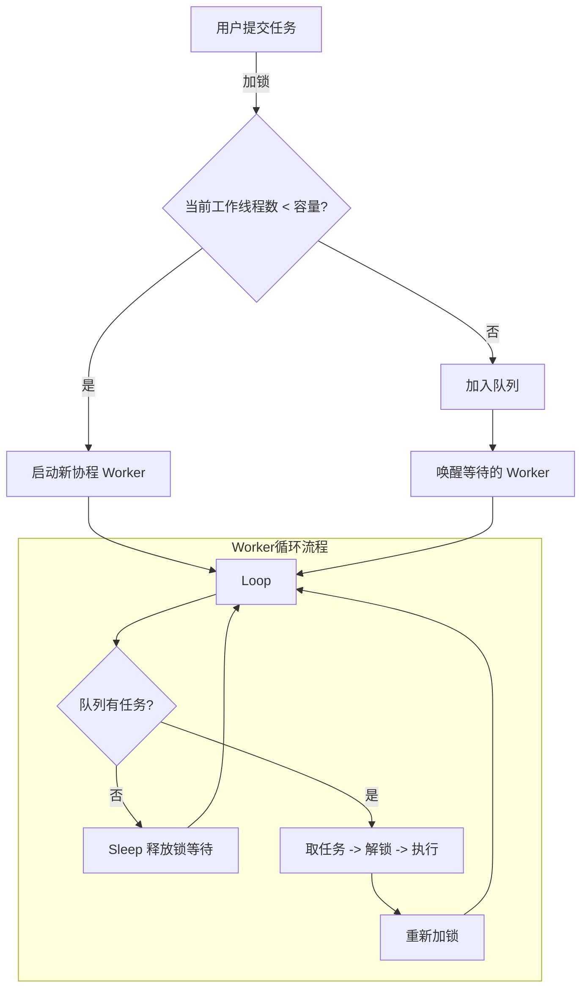
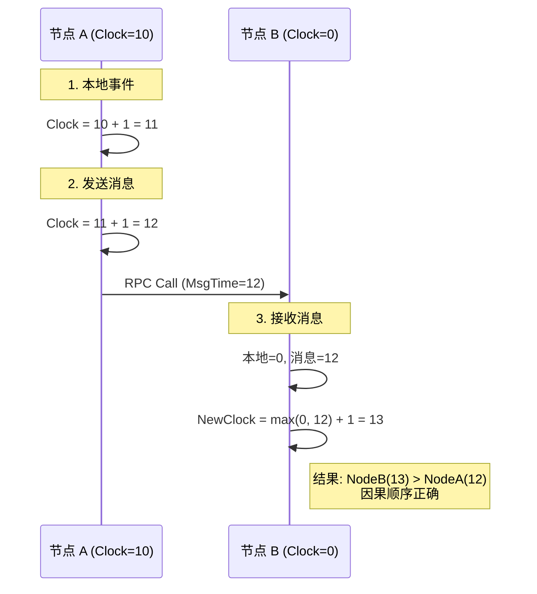
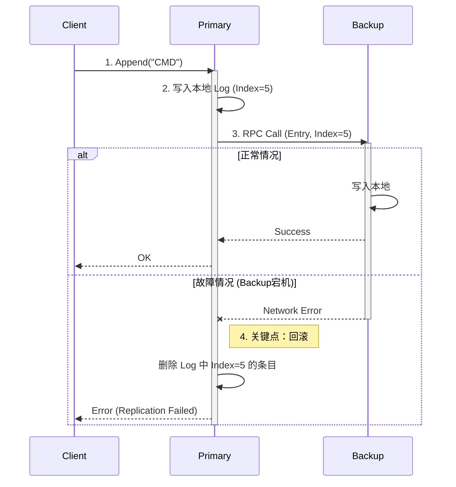

# 📘 分布式系统实验 (Distributed Systems Labs)

## 1. 项目概述

本项目是分布式系统课程的配套实践环节，旨在通过构建核心组件，帮助学生深入理解分布式计算中的关键问题：**并发控制 (Concurrency)**、**逻辑时序 (Logical Ordering)** 以及 **数据一致性 (Consistency)**。

本项目包含三个循序渐进的实验模块（Labs），要求学生在给定的代码框架下，补全关键逻辑，并通过所有的单元测试。

### 实验内容概览
*   **Lab 1: Bounded Worker Pool** - 解决高并发场景下的资源调度与协同问题。
*   **Lab 2: Lamport Logical Clock** - 解决分布式系统中的事件因果定序问题。
*   **Lab 3: Primary-Backup Replication** - 实现强一致性的日志复制与故障回滚机制。

---

## 2. 环境准备 (Prerequisites)

### 1. 环境搭建
分布式系统现在的主流语言是 **Go (Golang)**，因为它天生支持高并发。

1.  **下载 Go**: 访问 [go.dev/dl](https://go.dev/dl/) 下载并安装。
2.  **验证安装**: 打开终端（Terminal/CMD），输入 `go version`。
3.  **配置编辑器**: 推荐使用 **VS Code**，并安装 **Go** 插件。

### 2. Go 语言速成 (仅涵盖实验所需)
你不需要精通 Go，只需要看懂以下 4 个概念：

#### A. 结构体与方法 (Class的替代品)
Go 没有 `class`，只有 `struct`。
```go
type Node struct {
    ID int
}

// 这是一个方法，类似于 Java/C++ 的 this.SetID()
// *Node 表示传递指针，修改 n 会影响原对象
func (n *Node) SetID(id int) {
    n.ID = id
}
```

#### B. 协程 (Goroutine)
这是 Go 的杀手锏。启动一个线程只需要在函数前加 `go`。
```go
go func() {
    fmt.Println("我在后台运行！")
}()
```

#### C. 锁 (Mutex)
多线程同时读写一个变量会崩溃，必须加锁。
```go
var mu sync.Mutex
mu.Lock()
count++ // 只有拿到锁才能修改
mu.Unlock()
```

#### D. RPC (远程过程调用)
像调用本地函数一样调用远程函数。
```go
// Client 端
client.Call("Node.MethodName", args, reply)
```

### 2.3 项目初始化
当前仓库已包含完整的目录结构与测试用例。请拉取代码后在根目录执行：
```bash
go mod tidy  # 下载依赖并整理模块
```

---

## 🟢 Lab 1: 高并发任务池 (Bounded Worker Pool)

### 1.1 实验背景
**场景**：服务器瞬间收到 10000 个请求，如果开 10000 个线程，可能导致服务器严重卡顿甚至卡死。
**概述**：在生产级的高并发服务中，无限制地为每个请求创建 Goroutine 会导致内存耗尽（OOM）和调度开销过大。因此，**线程池（Worker Pool）** 是实现资源隔离和流量控制（Backpressure）的标准组件。

### 1.2 实验任务
在 `lab1/pool.go` 中实现一个具有**动态扩容**和**任务排队**能力的 Worker Pool。
*   **输入**: 任意数量的并发任务提交。
*   **约束**: 同时运行的 Worker 数量不得超过设定的 `capacity`。
*   **行为**: 当 Worker 达到上限时，新任务需进入队列等待，直到有 Worker 闲置。

### 1.3 架构设计
系统采用**生产者-消费者**模型，利用 `sync.Cond` 实现阻塞与唤醒机制。



### 1.4 实现指南
请重点完善 `pool.go` 中的以下逻辑：
1.  **任务提交 (Submit)**: 判断当前运行状态，决定是启动新 Goroutine 还是将任务加入队列。
2.  **工作循环 (workerLoop)**: 消费者逻辑，需正确处理 `Wait()` 挂起与任务执行的竞态条件。
3.  **优雅关闭 (Shutdown)**: 确保所有在列任务执行完毕后再销毁资源。

### 1.5 验证
```bash
cd lab1
go test -v -race  # -race 参数用于检测并发竞争
```

---

## 🟡 Lab 2: 分布式逻辑时钟 (Lamport Clock)

### 2.1 实验背景
**场景**：A 和 B 两台机器时间不同步。A 发消息给 B，B 收到时发现本地时间比 A 发送时间还早，因果错乱。
**概述**：在分布式系统中，由于物理时钟无法完美同步，我们无法仅凭物理时间戳确定事件的先后顺序。Leslie Lamport 提出的**逻辑时钟**算法，通过定义 "Happened-before" 关系，解决了分布式系统中的因果一致性问题。

### 2.2 实验任务
在 `lab2/node.go` 中实现 Lamport 时钟算法，确保系统满足以下不变性（Invariant）：
$$ 
\text{if } a \rightarrow b, \text{ then } C(a) < C(b) 
$$

### 2.3 交互流程



### 2.4 实现指南
请补全 `lab2/node.go` 中的核心方法：
1.  **LocalEvent()**: 处理本地事件的时钟推进。
2.  **SendMessage()**: 发送 RPC 请求前的时钟更新与参数封装。
3.  **HandleMessage()**: 接收 RPC 请求时的时钟合并逻辑（`max` 算法）。

### 2.5 验证
```bash
cd lab2
go test -v
```

---

## 🟠 Lab 3: 主从复制与原子性 (Primary-Backup Replication)

### 3.1 实验背景
**概述**：本实验构建了一个简化版的**强一致性**存储系统。为了保证数据的持久性，写入操作必须同步到备份节点（Backup）。系统的核心挑战在于处理**部分失败（Partial Failure）**：如果同步到 Backup 失败，主节点（Primary）必须回滚自身状态，以保证原子性（Atomicity）。

### 3.2 实验任务
在 `lab3/node.go` 中实现基于 RPC 的同步复制协议。
*   **Write**: 客户端请求写入 Primary。
*   **Replicate**: Primary 将日志条目同步至 Backup。
*   **Rollback**: 若 Backup 写入失败或响应超时，Primary 必须撤销本地的预写入。

### 3.3 逻辑流程图 (含故障回滚)



### 3.4 实现指南
这是三个实验中逻辑最复杂的部分，请重点关注 `node.go`：
1.  **Replicate 逻辑**: 必须是同步阻塞调用（Synchronous RPC），在收到 Backup 响应前不能向 Client 返回成功。
2.  **异常处理**: 在 RPC 返回错误或 `Success=false` 时，务必执行切片回退操作，移除脏数据。

### 3.5 验证
```bash
cd lab3
go test -v
```

---

## 📝 实验报告要求 (Report Requirements)

实验完成后，请提交一份 PDF 格式的实验报告，包含以下内容：

1.  **设计思路**
    - 简述每个 Lab 的核心数据结构设计（如 Struct 定义）
    - 针对每个 Lab，结合关键代码片段（如 Lab 1 的循环等待条件、Lab 2 的时钟更新公式、Lab 3 的回滚逻辑），解释你的设计思路
3.  **测试结果**
    *   提供三个 Lab 的 `go test` 成功运行截图。
    *   截图需包含测试用例名称及最终的 `PASS` 标识。

3.  **思考**
    1. **关于任务池 (Lab 1)**：
        - 如果将 sync.Cond 替换为 Go 语言的 Buffered Channel（缓冲通道），能否实现同样的功能？如果可以，简述实现思路；如果不可以，说明原因。
    2. **关于全序关系 (Lab 2)**：
        - Lamport 时钟保证了“如果 A -> B（A 发生于 B 之前），则 C(A) < C(B)”。**反之是否成立？** 如果我们观察到两个事件的时间戳 C(X) < C(Y)，是否一定能推断出 X 发生于 Y 之前？为什么？。
    3. **关于一致性缺陷 (Lab 3)**：
        1. **场景**：Primary 向 Backup 发送 RPC 请求，Backup 成功写入数据并返回 ACK。但在网络传输过程中，ACK 包丢失了。
        2. **后果**：此时 Primary 会认为请求超时失败，从而执行回滚（删除数据），而 Backup 却保留了数据。
        3. **问题**：这导致了主从数据不一致。在不引入完整共识算法（如 Raft）的前提下，你能想到什么简单的机制（如重试、幂等性设计）来缓解这个问题吗？

4. **问题与总结**

    *   在实验过程中遇到了哪些并发竞争（Race Condition）或死锁问题？是如何解决的？

    *   通过本次实验，对分布式系统的一致性有了怎样的新的理解？

