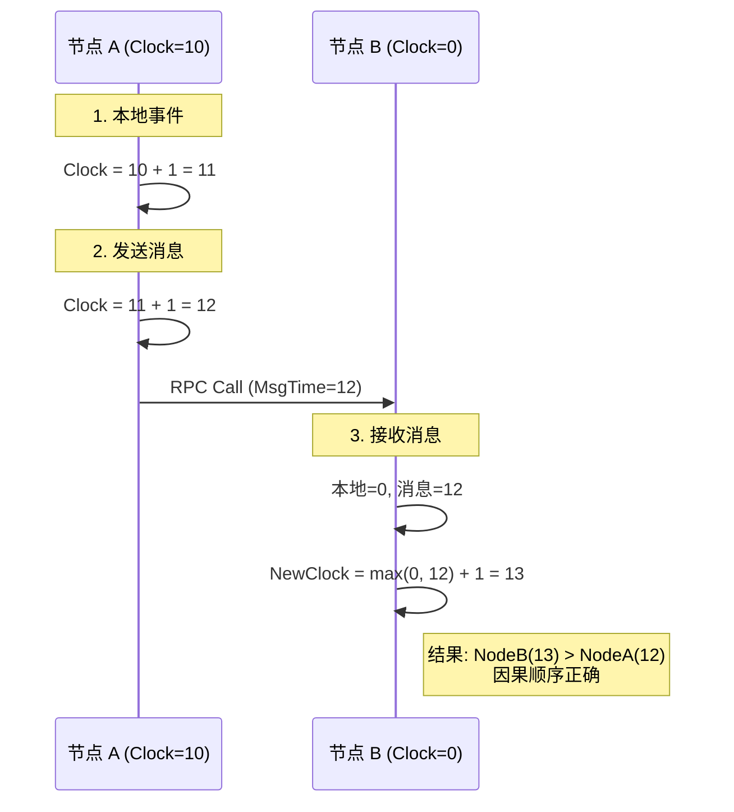
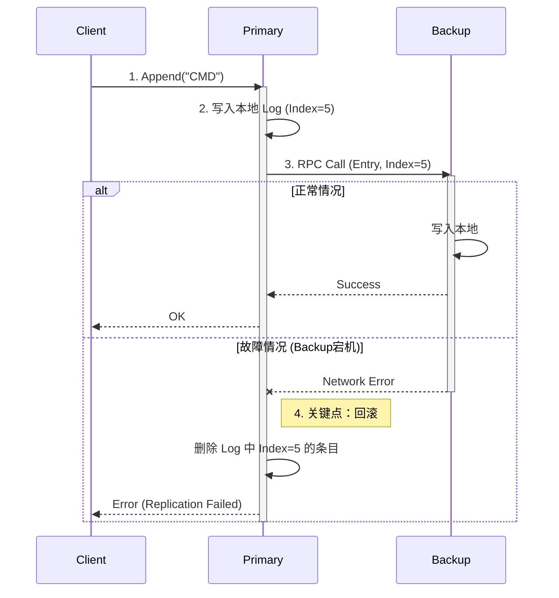

这是一份完整的、面向初学者的分布式系统实验指导书。

这份文档将带你从零开始，学习 Go 语言基础，搭建环境，并完成三个核心的分布式实验。

---

# 📘 分布式系统实验手册 (DSLabs v2)

**设计目标**：通过亲手实现核心组件，理解分布式系统的**并发**、**时序**和**一致性**。
**难度定位**：入门级 ~ 中级（比 MIT 6.824 简单，注重核心逻辑）。

---

## 🛠️ 第 0 章：准备工作

### 1. 环境搭建
分布式系统现在的主流语言是 **Go (Golang)**，因为它天生支持高并发。

1.  **下载 Go**: 访问 [go.dev/dl](https://go.dev/dl/) 下载并安装。
2.  **验证安装**: 打开终端（Terminal/CMD），输入 `go version`。
3.  **配置编辑器**: 推荐使用 **VS Code**，并安装 **Go** 插件。

### 2. Go 语言速成 (仅涵盖实验所需)
你不需要精通 Go，只需要看懂以下 4 个概念：

#### A. 结构体与方法 (Class的替代品)
Go 没有 `class`，只有 `struct`。
```go
type Node struct {
    ID int
}

// 这是一个方法，类似于 Java/C++ 的 this.SetID()
// *Node 表示传递指针，修改 n 会影响原对象
func (n *Node) SetID(id int) {
    n.ID = id
}
```

#### B. 协程 (Goroutine)
这是 Go 的杀手锏。启动一个线程只需要在函数前加 `go`。
```go
go func() {
    fmt.Println("我在后台运行！")
}()
```

#### C. 锁 (Mutex)
多线程同时读写一个变量会崩溃，必须加锁。
```go
var mu sync.Mutex
mu.Lock()
count++ // 只有拿到锁才能修改
mu.Unlock()
```

#### D. RPC (远程过程调用)
像调用本地函数一样调用远程函数。
```go
// Client 端
client.Call("Node.MethodName", args, reply)
```

### 3. 项目初始化
打开终端，执行以下命令建立项目骨架：

```bash
mkdir dslabs_v2
cd dslabs_v2
go mod init dslabs_v2  # 初始化模块
mkdir lab1 lab2 lab3   # 创建三个实验目录
```

---

## 🟢 Lab 1: 高并发任务池 (Worker Pool)

### 1. 实验目标
**场景**：服务器瞬间收到 10000 个请求，如果开 10000 个线程，服务器会挂。
**任务**：实现一个 `Worker Pool`，限制同时工作的线程数（比如只允许 5 个），超出的请求排队等待。

### 2. 逻辑流程图
我们使用 **条件变量 (Cond)** 来协调生产者（提交任务）和消费者（工人）。

```mermaid
graph TD
    User[用户提交任务] -->|加锁| Submit
    Submit{当前工人数 < 容量?}
    
    Submit -- Yes --> StartWorker[启动新协程 (Worker)]
    Submit -- No --> Enqueue[加入队列]
    Enqueue --> Signal[唤醒睡着的 Worker]
    
    StartWorker --> Loop
    Signal --> Loop
    
    subgraph Worker Loop
    Loop --> CheckQueue{队列有任务?}
    CheckQueue -- No --> Wait[Sleep (释放锁等待)]
    Wait --> Loop
    CheckQueue -- Yes --> RunTask[取任务 -> 解锁 -> 执行]
    RunTask --> Lock[重新加锁] --> Loop
    end
```

### 3. 实战步骤

#### 步骤 3.1: 创建文件
在 `lab1` 目录下创建 `pool.go` 和 `pool_test.go`。
*(代码请参考之前的对话，这里不再重复粘贴，重点讲如何填空)*

#### 步骤 3.2: 核心代码填空指南 (pool.go)

*   **填空 1: 提交任务**
    ```go
    // 把任务放到切片末尾
    p.tasks = append(p.tasks, t)
    ```
*   **填空 2: 动态扩容 (懒加载)**
    ```go
    if p.running < p.capacity {
        p.running++
        p.wg.Add(1)      // 告诉 WaitGroup 加人
        go p.workerLoop()
    } else {
        p.cond.Signal()  // 叫醒一个 Wait 的人
    }
    ```
*   **填空 3: 循环等待**
    ```go
    // 只要没任务且没关机，就一直睡
    for len(p.tasks) == 0 && !p.shutdown {
        p.cond.Wait()
    }
    ```
*   **填空 4: 取出任务**
    ```go
    task := p.tasks[0]
    p.tasks = p.tasks[1:]
    ```

#### 步骤 3.3: 运行
```bash
cd lab1
go test -v -race
```
*   **预期结果**: `PASS`。这证明你的池子既能限制并发，又不会死锁。

---

## 🟡 Lab 2: 分布式时钟 (Lamport Clock)

### 1. 实验目标
**场景**：A 和 B 两台机器时间不同步。A 发消息给 B，B 收到时发现本地时间比 A 发送时间还早，因果错乱。
**任务**：实现 **Lamport 逻辑时钟**，保证 `接收事件时间 > 发送事件时间`。

### 2. 逻辑流程图



### 3. 实战步骤

#### 步骤 3.1: 创建文件
在 `lab2` 目录下创建 `common.go`, `node.go`, `lamport_test.go`。
*(代码使用上一轮回答中的 RPC 版本)*

#### 步骤 3.2: 核心代码填空指南 (node.go)

*   **填空 1: 本地事件**
    ```go
    n.Clock++
    ```
*   **填空 2: 发送消息**
    ```go
    n.Clock++
    reqTime := n.Clock // 记录下此刻的时间戳
    n.mu.Unlock()      // RPC 前解锁，防止阻塞
    
    args := &LamportMsg{Timestamp: reqTime, ...}
    err := client.Call(...)
    ```
*   **填空 3: 接收消息 (HandleMessage)**
    ```go
    if args.Timestamp > n.Clock {
        n.Clock = args.Timestamp
    }
    n.Clock++
    ```

#### 步骤 3.3: 运行
```bash
cd ../lab2
go test -v
```
*   **预期结果**: 只有实现了上面的 max 逻辑，测试中的 `t2 <= t1` 断言才不会报错。

---

## 🟠 Lab 3: 日志复制 (Replication)

### 1. 实验目标
**场景**：这是 Raft 算法的雏形。我们要实现**强一致性**的主从复制。
**任务**：Client 写 Primary，Primary 同步给 Backup。**如果 Backup 挂了，Primary 必须回滚，不能独自保存数据。**

### 2. 逻辑流程图 (含故障回滚)



### 3. 实战步骤

#### 步骤 3.1: 创建文件
在 `lab3` 目录下创建 `common.go`, `node.go`, `repl_test.go`。
*(代码使用上一轮回答中的 RPC + Rollback 版本)*

#### 步骤 3.2: 核心代码填空指南 (node.go)

这是最难的一步，逻辑必须严密。

*   **填空 1: 乐观写入**
    ```go
    // 先假设会成功，写到自己小本本上
    n.Log = append(n.Log, entry)
    ```
*   **填空 2: RPC 调用**
    ```go
    err := n.peerClient.Call("Node.HandleAppendEntries", args, &reply)
    ```
*   **填空 3: 失败回滚 (核心)**
    ```go
    if err != nil || !reply.Success {
        // 既然同步失败，刚才写的那个就要作废
        n.Log = n.Log[:len(n.Log)-1]
        return fmt.Errorf("replication failed, rolled back")
    }
    ```

#### 步骤 3.3: 运行
```bash
cd ../lab3
go test -v
```
*   **预期结果**: `TestReplicationFailure` 会测试你有没有删掉脏数据。如果通过，恭喜你，你已经理解了强一致性的代价。

---

## 总结与后续

完成这三个 Lab 后，你实际上已经构建了一个微型的分布式数据库原型：
1.  **Lab 1**: 也就是数据库的**线程模型**。
2.  **Lab 2**: 也就是数据库的**MVCC（多版本并发控制）基础**。
3.  **Lab 3**: 也就是数据库的**高可用（HA）机制**。

**如何继续深造？**
如果你觉得这三个实验做完还有余力，下一步推荐去挑战 **MIT 6.824 的 Lab 2 (Raft)**。